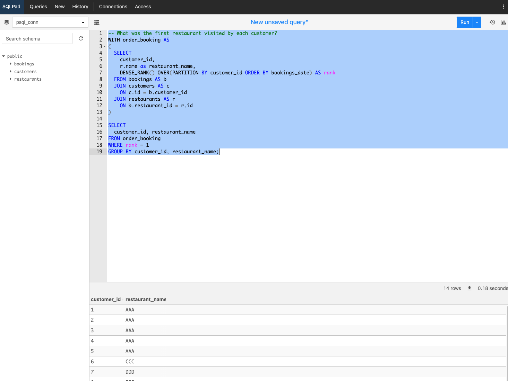

### Purpose

- I want to create SQL and have an UI to create/validate queries
- I need to confirm my SQL tables will work with the primary and foreign keys
- I want to load csv into SQL and see if my tables work


### SQL Queries

`SELECT * FROM customers`

`SELECT * FROM bookings`

`SELECT * FROM restaurants`

--How many days has each customer visited the restaurant? 

`SELECT customer_id, COUNT(DISTINCT(bookings_date)) AS visit_count FROM bookings GROUP BY customer_id;`


-- What was the first restaurent visited by each customer?

```
WITH order_booking AS
(
SELECT
customer_id,
r.name as restaurant_name,
DENSE_RANK() OVER(PARTITION BY customer_id ORDER BY bookings_date) AS rank
FROM bookings AS b
JOIN customers AS c
ON c.id = b.customer_id
JOIN restaurants AS r
ON c.restaurants_id = r.id
)

SELECT
customer_id, restaurant_name
FROM order_booking
WHERE rank = 1
GROUP BY customer_id, restaurant_name;
```

-- What was the first restaurant visited by each customer?


```
WITH order_booking AS
(
SELECT
customer_id,
r.name as restaurant_name,
DENSE_RANK() OVER(PARTITION BY customer_id ORDER BY bookings_date) AS rank
FROM bookings AS b
JOIN customers AS c
ON c.id = b.customer_id
JOIN restaurants AS r
ON b.restaurant_id = r.id
)

SELECT
customer_id, restaurant_name
FROM order_booking
WHERE rank = 1
GROUP BY customer_id, restaurant_name;
```


